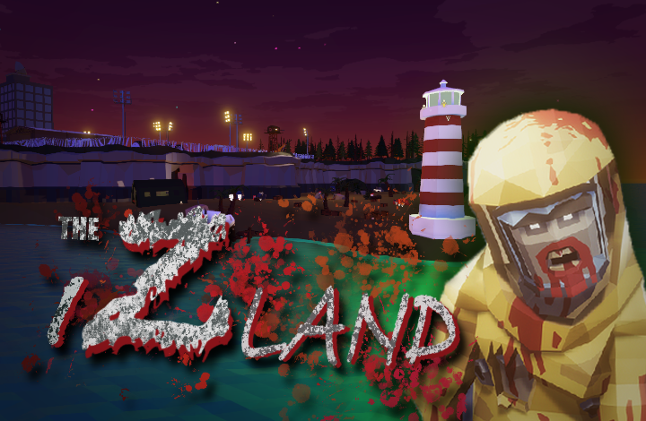
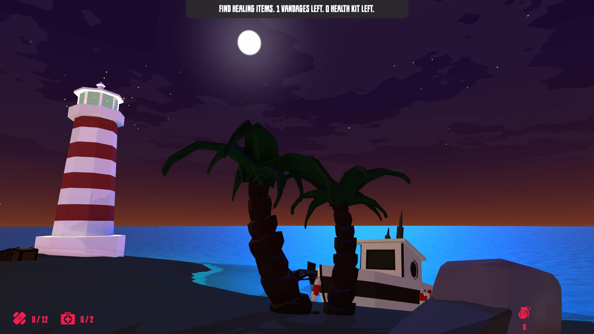
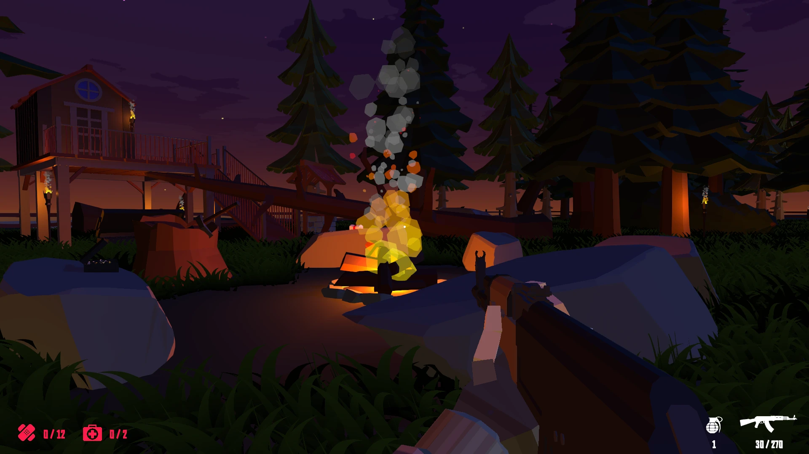
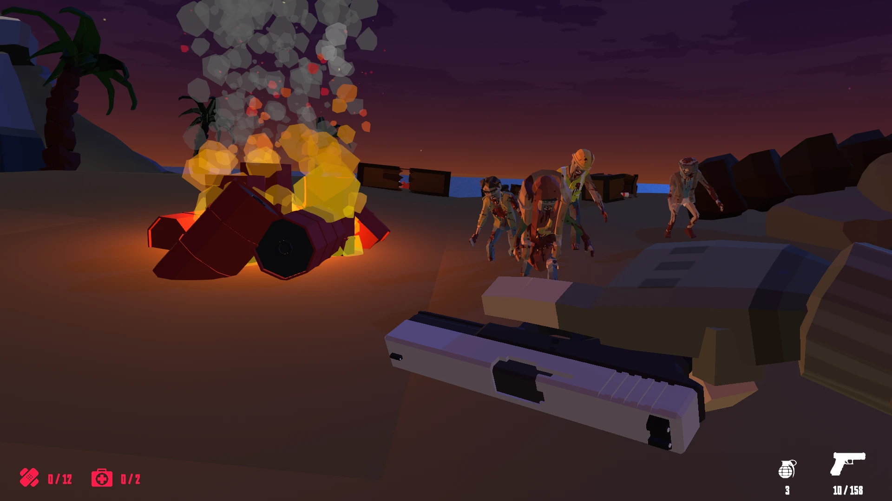
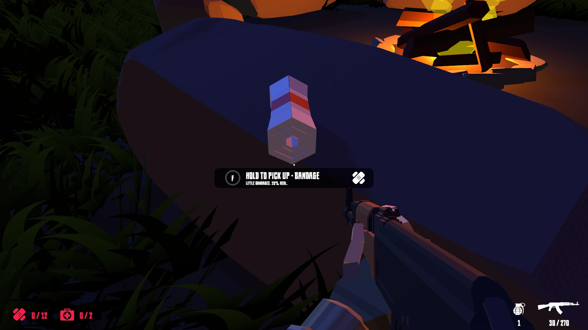
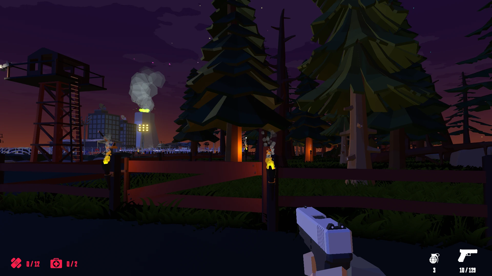
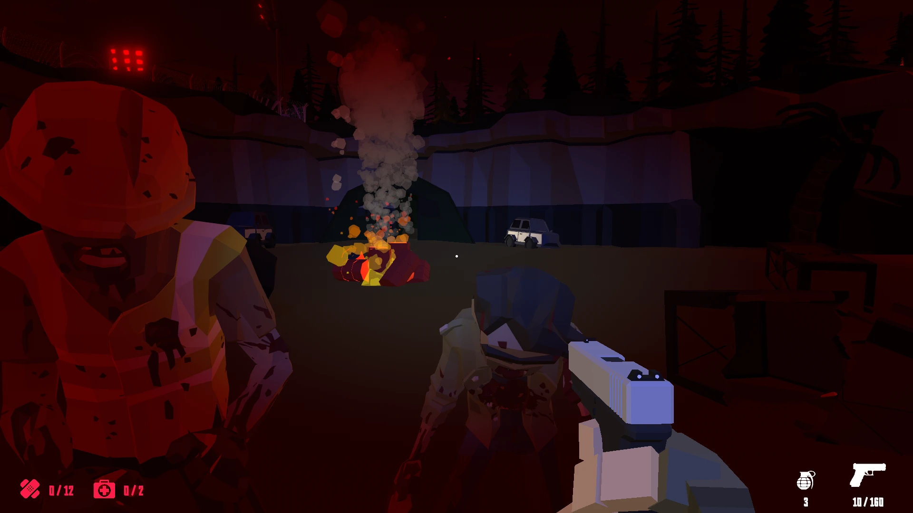

  <h1>🧟 The Izland</h1>
  

  

  📥 <a href="https://fivemost.itch.io/the-izland">Download</a>
  &nbsp;·&nbsp;
  🔑 <a href="https://github.com/iivvaannxx/the-izland?tab=License-1-ov-file">License</a>

  

  
<em><b>A zombie survival game made with Unity.</b></em>

  

     
  
  
    
  

> [!IMPORTANT]
> This repository is only a showcase of the game. It provides the links to download the game and information about it. The game is not open-source and the source code is not available, primarily due to the use of assets which license does not allow redistribution. The game is built using Unity.

## 📖 Introduction

The Izland is a zombie survival game developed by a team I was part of (Fivemost), as a project for a college subject where we were tasked to create a game using the Unity game engine. The game is set on a deserted island, where a military secret group forced scientists to experiment with humans. The experiments went wrong, and the island was infected with a virus that turned humans into zombies.

The player is the daughter of one of the scientists who was forced to work on the island, who was searching for her father. As the player, you have to survive and kill all the zombies on the island. Will you be able to escape the island? 

## 🛠️ How to Play

The game is available on the [itch.io page](https://fivemost.itch.io/the-izland) we created for our group. You can download it from there. After downloading it, extract the files and run the executable file, you don't need to install anything else.

## 🎮 Controls

Upon starting the game, you will be greeted with the main menu. You can start the game by clicking on the `Start` button. After starting the game, a short (~50 seconds) **non-skippable** cutscene will play and introduce you to the story of the game. 

Once the cutscene ends, you will be inside the game and the instructions will be displayed on the screen. On the top of the UI there's always the current objective you have to complete before proceeding to the next one. Just follow the instructions and you will be able to play the game without any issues.

> [!TIP]
> The subject required us to create a "special" mode (we called it "Admin Mode") to facilitate the testing of the game. To enable it, press the `G` upon you see the first tutorial message. This mode will prevent you from dying.

You can always check the controls by pressing the `ESC` key, which will pause the game and allow you to enter the "Options" menu and see them. The other controls are:

| Control | Key |
|---------|-----|
| Move the player | `W`, `A`, `S`, `D` |
| Jump | `Space` |
| Run | `Left Shift` |
| Fire | `LMB` |
| Aim | `RMB` |
| Pick up/Interact items | `F` |
| Reload | `R` |
| Show weapon | `Q` |
| Throw grenade | `G` |
| Pause | `ESC` |
| Primary Weapon | `1` |
| Secondary Weapon | `2` |
| Heal with Vandages (+20% Health) | `3` |
| Heal with Medical Kit (+100% Health) | `4` |

## 🤯 Known Bugs

Due to the time constraints we faced, we were unable to fix some bugs in the game. Those are:

- Some zombies may not "die" when they are shot. They actually die, but they keep the "running" animation and don't fall down. They won't move from their position nor attack you, so you can ignore them.

- It's actually unlikely, but the player may get stuck in a "running" state which can not be stopped. Sometimes pressing the Escape key to pause the game and then resuming it fixes the issue. If it doesn't, you'll have to restart the game.

> [!WARNING]
> The final stage of the game has a lot of zombies and the game may lag a bit if you don't have a good computer. 

## 📜 License

The Izland © 2020 by Fivemost is licensed under CC BY-NC-ND 4.0. To view the details of this license, visit this link.

## 📷 Screenshots

